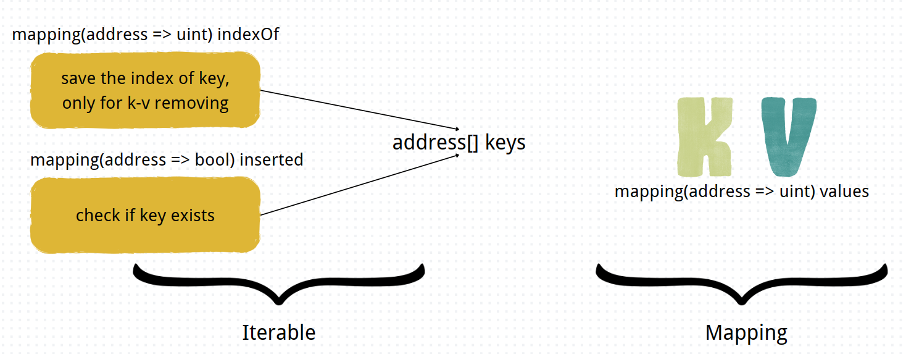

# basic code
**[operations on string](./MyString.sol)**
- concat strings
- get character at the given index
- replace character at the given index

# learn solidity-by-example

**This my [solidity-by-example](https://solidity-by-example.org) study notes**

## applications
[EtherWallet](./EtherWallet.sol)

[MultiSigWallet](./MultiSigWallet.sol)

[MerkleTree](./MerkleTree.sol)

- construction ways: recursion or double loop

[IterableMapping](./IterableMapping.sol)

[ERC20](./ERC20.sol)

[ERC721](./ERC721.sol)

[EnglishAuction](./EnglishAuction.sol)

[DutchAuction](./DutchAuction.sol)

[CrowdFund](./CrowdFund.sol)

[TimeLock](./TimeLock.sol)

## hacks
[ReEntrancy](./ReEntrancy.sol)

[Overflow and Underflow](./Overflow.sol)

[Source of Randomness](./Randomness.sol)

